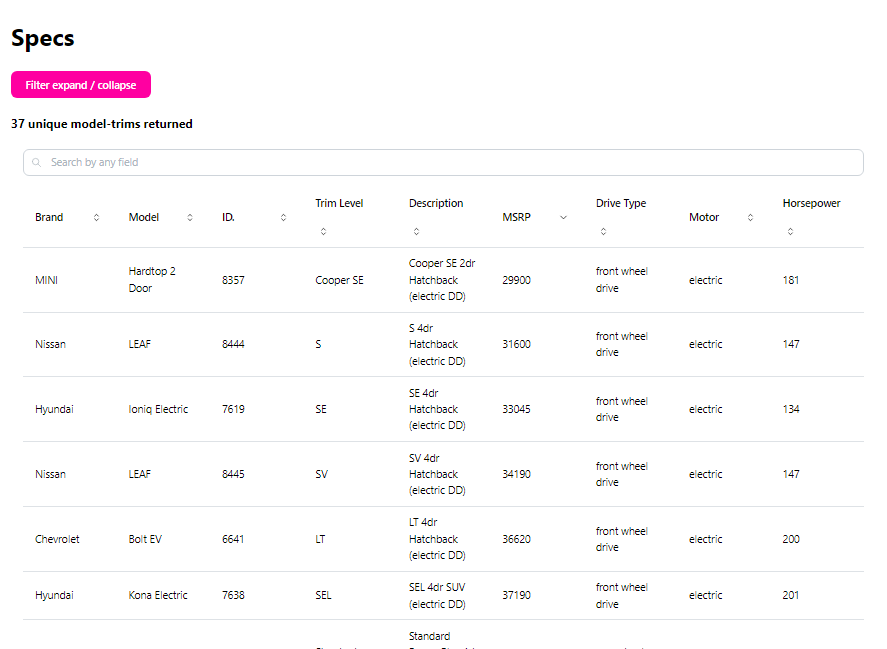

# EV Specs

Note: this project is early in development and therefore is buggy.  There are locations with placeholder text and code.  Thanks for checking it out anyway!! 

Project is currently deployed on Vercel:  https://evspecs.vercel.app/specs

## Description
This website is a platform for searching Electric Vehicles and finding detailed specifications on them.  The endgoal is to provide a wealth of information about EVs pulled in from outside APIs, as well as the ability to to parse, search, and filter this information in multiple ways depending on user inputs.



## Learning Objectives
- To further full-stack development skills
- To improve skills of pulling outside data from multiple APIs and filtering / sorting on the fly (information that does not neatly come out of one API)
- To learn the Next.js framework & create an app that's NOT a SPA
- To learn Typescript
- To build a professional-feeling website in terms of visuals and UI interaction

## Technologies Used
- Javascript & Typescript
- React
- Outside APIs
- Next.js (including SSR)
- Vercel hosting platform

## Starting
To run the development server after installng the project:

```bash
npm run dev
```

**Thank you for your interest in this project!**